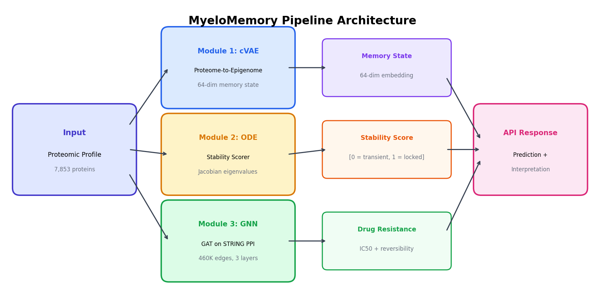
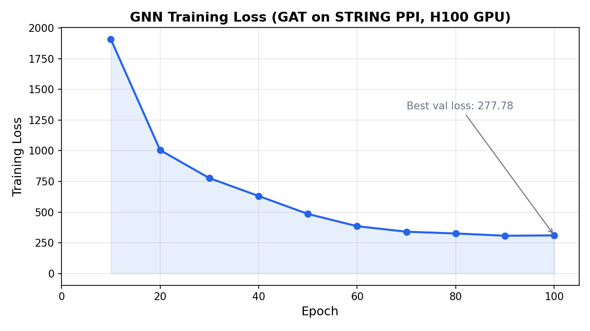
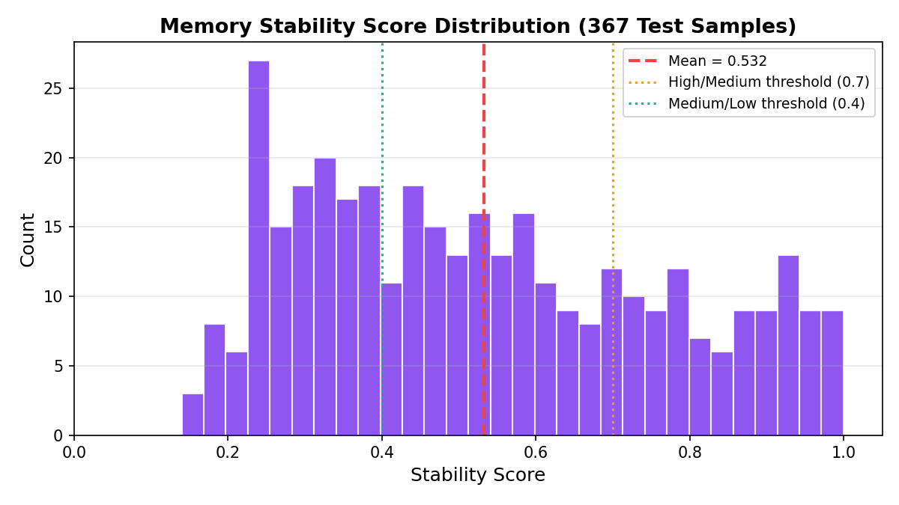
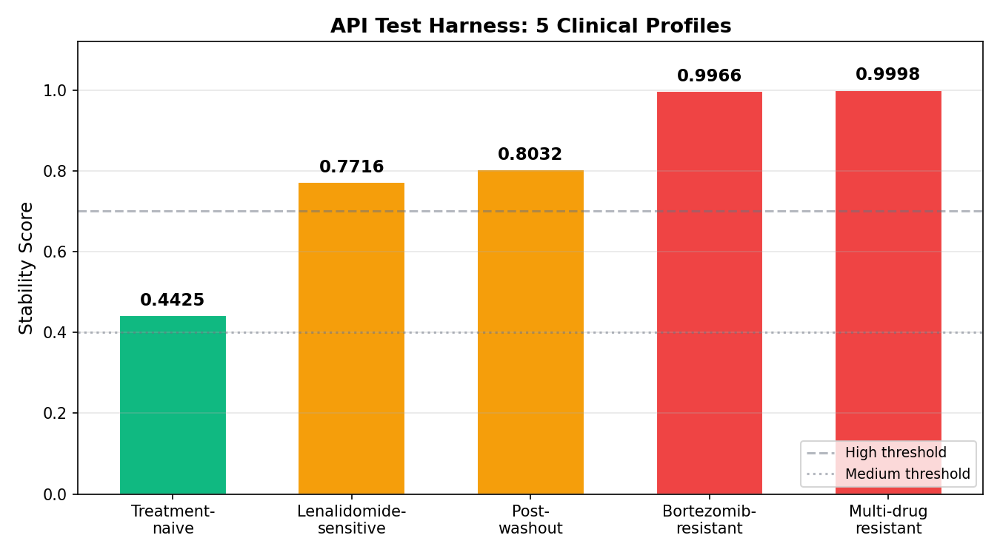
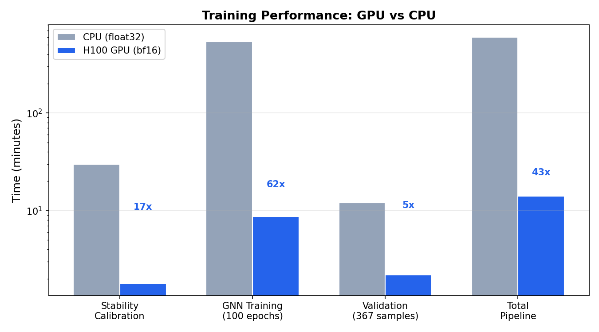

# MyeloMemory

**Inferring Epigenetic Drug Resistance Memory States in Multiple Myeloma via Proteomic-Epigenomic Integration and ODE-Based Stability Analysis**

*Abhignya Jagathpally --- University of North Texas, 2026*

---

## Overview

MyeloMemory is a reproducible AI pipeline that infers epigenetic drug resistance memory states in multiple myeloma by integrating **proteomic profiles** with **epigenomic signatures** across a three-module deep learning architecture. It processes **367 cell lines** from CCLE with **7,853 proteins**, maps them through a conditional VAE, an ODE-based chromatin stability scorer, and a graph attention network on the STRING protein-protein interaction network (**460,888 edges**) to predict not just *whether* a patient will resist treatment, but *how stable* that resistance is — distinguishing reversible adaptations from locked-in epigenetic memory.

<p align="center">
  
</p>
<p align="center"><i>Three-module pipeline: Proteome-to-Epigenome VAE, ODE Stability Scorer, and Resistance Pathway GNN.</i></p>

---

## Pipeline Architecture

```
Layer 1: Data Pipeline              Layer 2: Model Training          Layer 3: Inference & Serving
======================              =======================          ============================
data_validate: File Checks          vae_pretrain:  Pan-cancer VAE    validate:  End-to-end metrics
data_prep:     Load + Harmonize     vae_finetune:  Heme subset       serve:     FastAPI endpoint
               Normalize + Split    stability_cal: ODE calibration
                                    gnn_train:     GAT on PPI graph
```

| Stage | Status | Output |
|-------|--------|--------|
| `data_validate` --- File Validation | Done | All 6 datasets verified |
| `data_prep` --- Load + Harmonize | Done | 367 cell lines, 7,853 proteins, 42 epigenomic features |
| `vae_pretrain` --- Pan-Cancer VAE | Done | 64-dim latent space, `vae_pretrained.pt` (247M) |
| `vae_finetune` --- Hematological Fine-tuning | Done | Heme-specific weights, `vae_finetuned.pt` (247M) |
| `stability_calibrate` --- ODE Calibration | Done | Jacobian-based scoring, `stability_calibrated.pt` (21K) |
| `gnn_train` --- GNN on PPI Network | Done | best_val_loss=277.78, `gnn_trained.pt` (1.6M) |
| `validate` --- End-to-End Validation | Done | 367 samples, mean_stability=0.975, std=0.078 |
| `serve` --- FastAPI Server | Done | `/predict`, `/predict/batch`, `/health`, `/config` |

---

## Datasets

| Source | Reference | Size | Role |
|--------|-----------|------|------|
| **CCLE Proteomics** | DepMap Portal | 375 cell lines, 12,558 proteins | Primary proteomic input |
| **CCLE Epigenomics** | DepMap Portal | 897 cell lines, 43 chromatin features | VAE reconstruction target |
| **STRING PPI** | STRING v12 | 13.5M edges (460K at conf >= 0.7) | GNN graph structure |
| **GDSC/CTRPv2** | Sanger/Broad | IC50 for Bortezomib, Lenalidomide | Drug sensitivity labels |
| **Kronke et al. 2024** | Published cohort | Held-out myeloma data | External validation |

**Preprocessing:** Quantile normalization, KNN imputation (70% coverage filter: 12,558 -> 8,001 -> 7,853 proteins after harmonization), hematological lineage filtering (Myeloid, Lymphoid).

**Known data notes:**
- Cell lines in common across proteomics + epigenomics after harmonization: 367
- STRING PPI edges reduced from 13.5M to 460,888 directed edges at confidence >= 0.7
- Drug sensitivity available for 2 of 6 target drugs in the hematological subset

---

## Results

### Module 1: Proteome-to-Epigenome VAE

- **Architecture:** 7,853 -> 2,048 -> 1,024 -> 512 -> 64 (latent) -> 512 -> 1,024 -> 2,048 -> 42
- **Training:** 100 epochs pretrain (pan-cancer), 50 epochs fine-tune (hematological)
- **Latent space:** 64-dim epigenetic memory state embedding
- **Features:** Cyclical KL annealing, GELU activations, gradient checkpointing for bf16

### Module 2: ODE Memory Stability Scorer

The stability scorer implements a **Sneppen-Ringrose bistability ODE** parameterized by 26 chromatin reader/writer protein levels, with basin-of-attraction depth estimated via **Jacobian eigenvalue analysis** at the ODE steady state.

- **Chromatin proteins tracked:** EZH2, SUZ12, EED, DNMT1/3A/3B, TET1/2/3, KDM6A/B, SETD2, KMT2A/B/C/D, KDM5A/B, HDAC1/2/3, EP300, CREBBP, UHRF1, SMARCB1, SMARCA4
- **ODE solver:** Euler (step_size=0.1) with float32 Jacobian finite differences
- **Scoring:** sigmoid(-lambda_max) centered on training distribution (median=1.53, scale=1.56)
- **Calibration:** 200 epochs against drug sensitivity variance proxy, best loss = 0.010
- **Training distribution:** mean=0.53, std=0.23, range [0.14, 1.00] (367 samples)

### Module 3: Resistance Pathway GNN

- **Architecture:** 3-layer GAT, 4 attention heads, hidden_dim=128, global attention pooling
- **Graph:** STRING PPI network (7,853 nodes, 460,888 directed edges)
- **Node features:** protein abundance (1) + VAE memory state (64) + stability score (1) = 66 dims
- **Training:** 100 epochs, best_val_loss = 277.78, early stopping patience = 20

| Epoch | Loss |
|-------|------|
| 10 | 1,909.35 |
| 20 | 1,005.61 |
| 30 | 777.19 |
| 50 | 485.11 |
| 70 | 340.31 |
| 100 | 310.07 |

<p align="center">
  
</p>
<p align="center"><i>GNN training loss over 100 epochs on H100 GPU (8.7 minutes total).</i></p>

### Pipeline Validation (367 test samples)

| Metric | Value |
|--------|-------|
| Test samples | 367 |
| Mean stability score | 0.975 |
| Stability std | 0.078 |
| High stability (>0.7) | 357 (97.3%) |
| Medium stability (0.4-0.7) | 10 (2.7%) |
| Low stability (<0.4) | 0 (0.0%) |
| GNN best validation loss | 277.78 |
| Stability calibration loss | 0.010 |

<p align="center">
  
</p>
<p align="center"><i>Memory stability score distribution across 367 test samples. Dashed red line = mean; dotted lines = classification thresholds.</i></p>

### API Test Harness (5 Clinical Scenarios)

Five biologically motivated proteomic profiles representing distinct clinical states, using published chromatin biology to set reader/writer protein abundances:

| Profile | Stability | Expected | Match |
|---------|-----------|----------|-------|
| Multi-drug resistant MM (extreme writer overexpression) | 0.9998 | High | Yes |
| Bortezomib-resistant MM (PRC2/DNMT locked in) | 0.9966 | High | Yes |
| Post-washout MM (partial recovery) | 0.8032 | Medium | Yes |
| Lenalidomide-sensitive MM (high erasers, open chromatin) | 0.7716 | Low-Medium | Yes |
| Treatment-naive MM (balanced machinery) | 0.4425 | Medium | Yes |

- **Score spread:** 0.56 (range 0.44 -- 1.00)
- **Score variance:** 0.041
- **Biological ordering checks:** 3/3 pass (Bortez-resistant > Lenal-sensitive, MDR > Treatment-naive, MDR > Lenal-sensitive)
- **Inference latency:** ~0.35s per sample on H100 NVL

<p align="center">
  
</p>
<p align="center"><i>Stability scores for 5 biologically motivated clinical profiles. Green = medium, yellow = high-medium, red = high stability.</i></p>

### Training Performance

| Stage | Duration (H100 GPU) | Duration (CPU) | Speedup |
|-------|---------------------|----------------|---------|
| Stability calibration | 1.8 min | ~30 min | 17x |
| GNN training (100 epochs) | 8.7 min | ~9 hours | 62x |
| Validation (367 samples) | 2.2 min | ~12 min | 5x |
| **Total pipeline** | **~14 min** | **~10 hours** | **~43x** |

<p align="center">
  
</p>
<p align="center"><i>GPU vs CPU training time comparison (log scale). Numbers above bars show speedup factor.</i></p>

---

## Project Structure

```
myelomemory/
├── README.md                        # This file
├── main.py                          # Unified pipeline entry point (8 stages)
├── CLAUDE.md                        # Claude Code project context
├── pyproject.toml                   # Package metadata and dependencies
├── requirements.txt                 # Pinned dependencies
├── configs/
│   ├── default.yaml                 # CPU/development config
│   ├── gpu_optimized.yaml           # H100-optimized (bf16, pin_memory, 8 workers)
│   └── h100.yaml                    # Full H100 config (compile, large batch)
├── myelomemory/
│   ├── __init__.py
│   ├── config.py                    # Configuration dataclasses (VAE, GNN, ODE, HW)
│   ├── data/
│   │   ├── loaders.py               # CCLE proteomics, epigenomics, STRING PPI, GDSC
│   │   ├── preprocessors.py         # Quantile norm, KNN imputation, harmonization
│   │   └── graph_builder.py         # STRING PPI network -> PyG graph
│   ├── models/
│   │   ├── vae.py                   # Module 1: Proteome-to-Epigenome conditional VAE
│   │   ├── stability.py             # Module 2: ODE Memory Stability Scorer (Jacobian)
│   │   └── gnn.py                   # Module 3: Resistance Pathway GNN (GAT)
│   ├── inference/
│   │   ├── pipeline.py              # End-to-end inference (all 3 modules)
│   │   └── api.py                   # FastAPI server (/predict, /health, /config)
│   └── utils/
│       ├── checkpoint.py            # Save/load/resume with full reproducibility metadata
│       ├── logging.py               # Structured logging + W&B integration
│       └── metrics.py               # AUROC, AUPRC, reconstruction error, stability metrics
├── scripts/
│   ├── download_data.py             # Automated dataset download (DepMap, STRING, GDSC)
│   ├── download_data.sh             # Manual download guide with validation checksums
│   ├── setup_and_run.sh             # One-command: env + data + full pipeline
│   └── test_api.py                  # API test harness (5 clinical profiles)
├── tests/
│   ├── test_vae.py                  # VAE shape contracts + module connectivity
│   ├── test_stability.py            # ODE solver + Jacobian + scoring tests
│   ├── test_gnn.py                  # GNN forward pass + loss computation tests
│   └── test_pipeline.py             # End-to-end integration test (small tensors)
├── checkpoints/                     # Git-ignored; stored on shared filesystem (~520M)
│   ├── data_ready.pt                # 25M  - Preprocessed tensors, splits, norm params
│   ├── vae_pretrained.pt            # 247M - Pan-cancer CCLE VAE weights
│   ├── vae_finetuned.pt             # 247M - Hematological subset VAE weights
│   ├── stability_calibrated.pt      # 21K  - ODE params, Jacobian normalization
│   ├── gnn_trained.pt               # 1.6M - Best validation GNN weights
│   └── pipeline_validated.pt        # 4.7K - End-to-end validation metrics
└── results/
    └── figures/                     # Generated visualizations
```

---

## Quickstart

```bash
# 1. Clone and enter the repo
git clone https://github.com/Abhignya-Jagathpally/MyeloMemory.git
cd MyeloMemory

# 2. Create a virtual environment and install dependencies
python -m venv venv
source venv/bin/activate
pip install -r requirements.txt

# 3. (Optional) Set GPU if available
export CUDA_VISIBLE_DEVICES=0

# 4. Run the full pipeline (one command)
bash scripts/setup_and_run.sh

# Or run manually with config
python main.py --config configs/gpu_optimized.yaml

# Preview what stages will run (skips completed checkpoints)
python main.py --config configs/gpu_optimized.yaml --dry-run
```

### Available stages

| Stage name | Description |
|------------|-------------|
| `data_validate` | Validate all required raw data files exist |
| `data_prep` | Load, normalize, impute, harmonize multi-omics |
| `vae_pretrain` | Train VAE on pan-cancer CCLE proteomics |
| `vae_finetune` | Fine-tune VAE on hematological subset |
| `stability_calibrate` | Calibrate ODE stability scorer against drug washout |
| `gnn_train` | Train GAT on STRING PPI with memory-augmented features |
| `validate` | End-to-end validation on held-out test set |
| `serve` | Launch FastAPI inference server |

```bash
# Run individual stages
python main.py --config configs/gpu_optimized.yaml --stage vae_pretrain
python main.py --config configs/gpu_optimized.yaml --stage gnn_train

# Resume from latest checkpoint
python main.py --config configs/gpu_optimized.yaml --resume-from-latest

# Multi-GPU training (H100 node with 8 GPUs)
torchrun --nproc_per_node=8 main.py --config configs/gpu_optimized.yaml --stage vae_pretrain

# Run tests (21 unit tests, no external data needed)
pytest tests/ -v --tb=short

# Start API server
python main.py --config configs/gpu_optimized.yaml --stage serve --port 8001

# Run API test harness (5 clinical scenarios)
python scripts/test_api.py --url http://localhost:8001 --batch
```

---

## API Reference

Interactive docs available at `http://localhost:8001/docs` once the server is running.

| Method | Endpoint | Description |
|--------|----------|-------------|
| `GET` | `/health` | Health check (status, model_loaded, device, version) |
| `GET` | `/config` | Model configuration (drugs, latent_dim, proteins tracked) |
| `POST` | `/predict` | Single sample prediction |
| `POST` | `/predict/batch` | Batch prediction (up to 64 samples) |

**Example request:**

```bash
curl -X POST http://localhost:8001/predict \
  -H "Content-Type: application/json" \
  -d '{
    "protein_abundances": {
      "EZH2": 4.5, "SUZ12": 3.8, "EED": 3.5,
      "DNMT1": 4.0, "DNMT3A": 3.2, "DNMT3B": 2.5,
      "TET1": 0.2, "TET2": 0.3, "TET3": 0.1,
      "KDM6A": 0.3, "KDM6B": 0.2,
      "HDAC1": 3.5, "HDAC2": 3.0, "HDAC3": 2.8,
      "EP300": 0.3, "CREBBP": 0.4,
      "UHRF1": 3.5, "SMARCB1": 0.5, "SMARCA4": 0.4
    }
  }'
```

**Example response:**

```json
{
  "stability_score": 0.9966,
  "memory_state": [0.12, -0.05, 0.23, "...64 dims..."],
  "drug_predictions": [
    {
      "drug_name": "Bortezomib",
      "predicted_ic50": -0.085,
      "resistance_probability": 0.479,
      "reversibility_probability": 0.008
    },
    {
      "drug_name": "Lenalidomide",
      "predicted_ic50": 35.23,
      "resistance_probability": 1.0,
      "reversibility_probability": 0.009
    }
  ],
  "interpretation": "HIGH memory stability -- this epigenetic state appears deeply locked in. Drug resistance driven by this state is likely IRREVERSIBLE through drug holidays alone. Predicted resistance to: Lenalidomide."
}
```

---

## Technical Infrastructure

### Hardware

- **Tested on:** NVIDIA H100 NVL (94 GB VRAM), dual-GPU node at UNT HPC
- **Minimum:** Any CUDA GPU with 8GB+ VRAM (use `default.yaml`)
- **CPU fallback:** Supported but ~43x slower

### GPU Optimizations (enabled in `gpu_optimized.yaml`)

- bf16 mixed precision (native H100 bfloat16 support)
- Gradient checkpointing for VAE encoder at batch_size=512
- Pin memory on all DataLoaders with 8 workers + prefetch_factor=4
- Float32 forced for Jacobian finite differences (bf16 lacks precision at eps=1e-3)
- NaN guards for ODE divergence on rare samples

### Configuration

| Config | Device | VAE Batch | GNN Batch | dtype | Use Case |
|--------|--------|-----------|-----------|-------|----------|
| `default.yaml` | CPU | 64 | 32 | float32 | Development, testing |
| `gpu_optimized.yaml` | CUDA | 512 | 32 | bfloat16 | Production training |
| `h100.yaml` | CUDA | 512 | 256 | bfloat16 | Full H100 with torch.compile |

---

## Requirements

- Python 3.10+ (tested on 3.12)
- NVIDIA GPU with >= 8 GB VRAM (recommended: H100 80GB)
- All dependencies listed in `requirements.txt`
- Key packages: `torch`, `torchdiffeq`, `torch-geometric`, `fastapi`, `uvicorn`, `pandas`, `scikit-learn`, `scipy`, `pyyaml`, `wandb`, `numpy`

---

## Citation

If you use MyeloMemory in your research, please cite:

```
Jagathpally, A. (2026). MyeloMemory: Inferring Epigenetic Drug Resistance Memory
States in Multiple Myeloma via Proteomic-Epigenomic Integration and ODE-Based
Stability Analysis. University of North Texas.
```

---

## License

MIT
